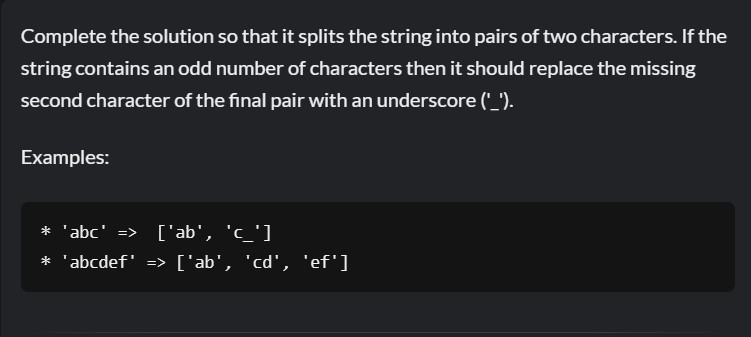

# Challenges Codewars

This repositorio contains the solved challenges from the page Codewars, the challenges were resolved using two programming languages: Python and JavaScript.

## JavaScript challenges

1. Challenge 1 - Highest and lowest

2. Challenge 2 - Complementary DNA

3. Challenge 3 - Your order please

4. Challenge 3 - Simple Pig Lating

5. Challenge 4 - Array diff

## Python challenges

1. Challenge 1 - Split Strings

2. Challenge 2 - Convert string to camelCase

3. Challenge 3 - You are a square

4. Challenge 4 - Complementary DNA

5. Challenge 5 - Sum of two lowest positive int

